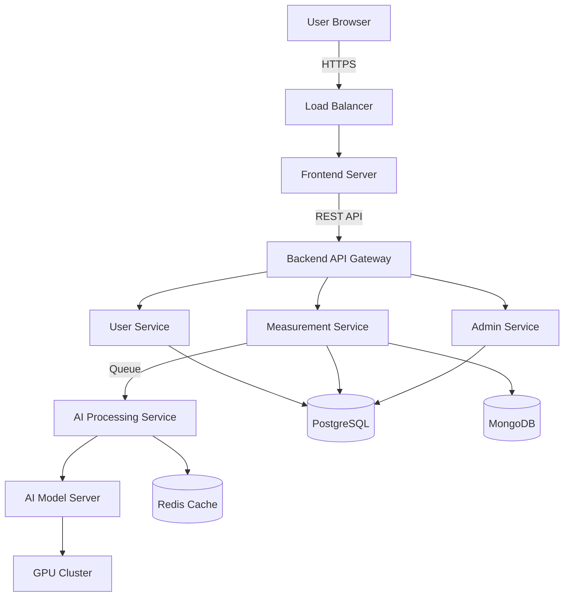

# Software Requirements Specification (SRS)
## AI-Based Body Size Measurement Website
### Male & Female Body Measurement System

---

**Document Version:** 1.0  
**Date:** February 7, 2026  
**Prepared By:** Development Team  
**Project Name:** AI-Based Body Size Measurement System

---

## Table of Contents

1. [Introduction](#1-introduction)
2. [Objective](#2-objective)
3. [User Types](#3-user-types)
4. [Functional Requirements](#4-functional-requirements)
5. [Admin Functional Requirements](#5-admin-functional-requirements)
6. [Non-Functional Requirements](#6-non-functional-requirements)
7. [AI & ML Requirements](#7-ai--ml-requirements)
8. [System Architecture](#8-system-architecture)
9. [Integration Requirements](#9-integration-requirements)
10. [Optional Advanced Features](#10-optional-advanced-features)
11. [Technology Stack](#11-technology-stack)
12. [Use Cases](#12-use-cases)
13. [Conclusion](#13-conclusion)

---

## 1. Introduction

This document specifies the requirements for an AI-based body size measurement system designed to automatically measure male and female body dimensions using computer vision and machine learning technologies. The system aims to revolutionize the fashion and fitness industries by providing accurate, contactless body measurements.

### 1.1 Purpose

The purpose of this system is to:
- Eliminate manual measurement errors in clothing purchases
- Reduce product returns in e-commerce
- Support custom tailoring services
- Enable fitness tracking and health analysis
- Provide gender-specific accurate measurements

### 1.2 Scope

The system will provide:
- Web-based measurement capture interface
- AI-powered body dimension extraction
- Gender-specific measurement parameters
- Automated size recommendations
- User profile and history management
- Admin dashboard for monitoring and analytics

### 1.3 Definitions and Acronyms

- **AI**: Artificial Intelligence
- **ML**: Machine Learning
- **API**: Application Programming Interface
- **SRS**: Software Requirements Specification
- **UI/UX**: User Interface/User Experience
- **AR**: Augmented Reality
- **REST**: Representational State Transfer

---

## 2. Objective

### 2.1 Primary Objectives

1. **Automated Measurement**: To automatically measure male and female body dimensions using AI with minimal user intervention
2. **Error Reduction**: To minimize manual errors and returns in clothing purchases through accurate measurements
3. **Multi-Industry Support**: To support custom tailoring, fashion e-commerce, fitness tracking, and health analysis applications

### 2.2 Success Criteria

- Measurement accuracy within ±1-2 cm tolerance
- Processing time under 10 seconds per measurement session
- User satisfaction rate above 85%
- Reduction in clothing returns by at least 30%

---

## 3. User Types

### 3.1 End Users

#### 3.1.1 Male User
- Can capture body measurements using front, side, and back poses
- Receives measurements specific to male body parameters
- Gets size recommendations for men's clothing

#### 3.1.2 Female User
- Can capture body measurements using front, side, and back poses
- Receives measurements specific to female body parameters
- Gets size recommendations for women's clothing

### 3.2 Administrator
- Manages user accounts and profiles
- Monitors AI model performance
- Validates and corrects measurements
- Manages size charts and brand mappings
- Accesses analytics and reporting dashboards

### 3.3 AI System
- Automated measurement engine
- Processes images/videos to extract body dimensions
- Provides confidence scores for measurements
- Learns and improves from feedback

---

## 4. Functional Requirements

### 4.1 User Account Management

#### 4.1.1 Registration & Authentication
- **FR-1.1**: System shall support user registration via email or mobile OTP
- **FR-1.2**: System shall implement secure login with password encryption
- **FR-1.3**: System shall support password recovery mechanism
- **FR-1.4**: System shall enforce strong password policies

#### 4.1.2 Gender Selection
- **FR-1.5**: System shall require users to select gender (Male/Female) during registration
- **FR-1.6**: System shall allow users to update gender selection in profile settings
- **FR-1.7**: System shall customize measurement parameters based on selected gender

#### 4.1.3 Profile Management
- **FR-1.8**: Users shall be able to view and edit personal information
- **FR-1.9**: Users shall be able to manage multiple measurement profiles (self/family members)
- **FR-1.10**: System shall store user preferences (units, language, fit preference)

#### 4.1.4 Measurement History
- **FR-1.11**: System shall maintain complete measurement history for each user
- **FR-1.12**: Users shall be able to view past measurements with timestamps
- **FR-1.13**: System shall allow comparison between different measurement sessions
- **FR-1.14**: Users shall be able to export measurement data in PDF/CSV format

### 4.2 AI-Based Measurement Capture

#### 4.2.1 Image/Video Capture
- **FR-2.1**: System shall support image capture via mobile camera or webcam
- **FR-2.2**: System shall support video capture for dynamic pose detection
- **FR-2.3**: System shall provide real-time pose alignment guidance overlay
- **FR-2.4**: System shall detect and guide users to correct front, side, and back poses
- **FR-2.5**: System shall validate image quality before processing

#### 4.2.2 Background Detection & Removal
- **FR-2.6**: System shall automatically detect and remove background from captured images
- **FR-2.7**: System shall work with various background conditions
- **FR-2.8**: System shall isolate the human body from surrounding objects

#### 4.2.3 AI Body Detection
- **FR-2.9**: System shall perform human body segmentation
- **FR-2.10**: System shall detect skeletal landmarks using pose estimation
- **FR-2.11**: System shall map gender-specific body landmarks
- **FR-2.12**: System shall normalize height using reference objects (credit card/A4 sheet)
- **FR-2.13**: System shall handle different body types, heights, and ethnicities

### 4.3 Body Measurement Parameters

#### 4.3.1 Male Measurements
- **FR-3.1**: System shall measure the following parameters for male users:
  - Height
  - Chest circumference
  - Waist circumference
  - Hip circumference
  - Shoulder width
  - Neck circumference
  - Sleeve length
  - Arm length
  - Inseam/Outseam
  - Thigh circumference
  - Calf circumference

#### 4.3.2 Female Measurements
- **FR-3.2**: System shall measure the following parameters for female users:
  - Height
  - Bust circumference
  - Under-bust circumference
  - Waist circumference
  - Hip circumference
  - Shoulder width
  - Arm length
  - Sleeve length
  - Neck circumference
  - Thigh circumference
  - Calf circumference

#### 4.3.3 Unit Support
- **FR-3.3**: System shall support both metric (cm) and imperial (inches) units
- **FR-3.4**: Users shall be able to switch between unit systems

### 4.4 AI Measurement Processing

#### 4.4.1 Keypoint Extraction
- **FR-4.1**: System shall extract anatomical keypoints from captured images
- **FR-4.2**: System shall identify gender-specific measurement points
- **FR-4.3**: System shall handle partial occlusions and pose variations

#### 4.4.2 Distance Calculation
- **FR-4.4**: System shall calculate distances in real-world units (cm/inches)
- **FR-4.5**: System shall use reference objects for scale calibration
- **FR-4.6**: System shall apply perspective correction algorithms

#### 4.4.3 Body Proportion Analysis
- **FR-4.7**: System shall analyze body proportions for validation
- **FR-4.8**: System shall detect and flag anomalous measurements
- **FR-4.9**: System shall use ML models for error correction

#### 4.4.4 Confidence Scoring
- **FR-4.10**: System shall provide confidence scores (0-100%) for each measurement
- **FR-4.11**: System shall flag low-confidence measurements for review
- **FR-4.12**: System shall recommend re-capture if confidence is below threshold

### 4.5 Size Recommendation Engine

#### 4.5.1 Size Prediction
- **FR-5.1**: System shall automatically suggest clothing sizes (XS, S, M, L, XL, XXL)
- **FR-5.2**: System shall provide gender-specific size recommendations
- **FR-5.3**: System shall support international size standards (US, UK, EU, Asia)

#### 4.5.2 Brand Mapping
- **FR-5.4**: System shall map measurements to brand-specific size charts
- **FR-5.5**: Admin shall be able to add and update brand size charts
- **FR-5.6**: System shall support multiple brands and retailers

#### 4.5.3 Fit Preferences
- **FR-5.7**: Users shall be able to select fit preference:
  - Slim fit
  - Regular fit
  - Loose fit
- **FR-5.8**: System shall adjust size recommendations based on fit preference
- **FR-5.9**: System shall learn from user feedback on fit accuracy

---

## 5. Admin Functional Requirements

### 5.1 User & Profile Management
- **FR-6.1**: Admin shall be able to view all user accounts
- **FR-6.2**: Admin shall be able to activate/deactivate user accounts
- **FR-6.3**: Admin shall be able to reset user passwords
- **FR-6.4**: Admin shall be able to view user measurement history

### 5.2 AI Model Monitoring
- **FR-6.5**: Admin shall be able to monitor AI model performance metrics
- **FR-6.6**: System shall display accuracy statistics and error rates
- **FR-6.7**: Admin shall receive alerts for model performance degradation
- **FR-6.8**: Admin shall be able to trigger model retraining

### 5.3 Measurement Validation & Correction
- **FR-6.9**: Admin shall be able to review flagged measurements
- **FR-6.10**: Admin shall be able to manually correct measurements
- **FR-6.11**: System shall log all admin corrections for model improvement
- **FR-6.12**: Admin shall be able to approve/reject measurements

### 5.4 Size Chart Management
- **FR-6.13**: Admin shall be able to add new brand size charts
- **FR-6.14**: Admin shall be able to update existing size charts
- **FR-6.15**: Admin shall be able to manage gender-specific size mappings
- **FR-6.16**: System shall version control size chart changes

### 5.5 Analytics Dashboard
- **FR-6.17**: Admin shall have access to comprehensive analytics dashboard
- **FR-6.18**: Dashboard shall display:
  - Total users and measurements
  - Average processing time
  - Accuracy metrics
  - User satisfaction scores
  - Popular size distributions
  - Error feedback analysis
- **FR-6.19**: Admin shall be able to export analytics reports

---

## 6. Non-Functional Requirements

### 6.1 Performance Requirements

#### 6.1.1 Response Time
- **NFR-1.1**: AI processing time shall be less than 10 seconds per measurement session
- **NFR-1.2**: Page load time shall be less than 3 seconds
- **NFR-1.3**: API response time shall be less than 500ms for non-AI operations

#### 6.1.2 Accuracy
- **NFR-1.4**: Measurement accuracy shall be within ±1-2 cm tolerance
- **NFR-1.5**: System shall achieve minimum 90% accuracy on validation dataset
- **NFR-1.6**: Size recommendation accuracy shall be above 85%

#### 6.1.3 Scalability
- **NFR-1.7**: System shall support at least 1000 concurrent users
- **NFR-1.8**: System shall handle 10,000 measurements per day
- **NFR-1.9**: System architecture shall be horizontally scalable

#### 6.1.4 Device Optimization
- **NFR-1.10**: System shall be optimized for mobile devices
- **NFR-1.11**: Camera capture shall work on iOS and Android browsers
- **NFR-1.12**: UI shall be responsive across all screen sizes

### 6.2 Usability Requirements

#### 6.2.1 User Interface
- **NFR-2.1**: System shall provide simple step-by-step capture guide
- **NFR-2.2**: System shall provide visual feedback during scanning
- **NFR-2.3**: UI shall follow modern design principles
- **NFR-2.4**: System shall be intuitive for non-technical users

#### 6.2.2 Accessibility
- **NFR-2.5**: System shall comply with WCAG 2.1 Level AA standards
- **NFR-2.6**: System shall support screen readers
- **NFR-2.7**: System shall provide keyboard navigation
- **NFR-2.8**: System shall support high contrast mode

#### 6.2.3 Localization
- **NFR-2.9**: System shall support multi-language interface
- **NFR-2.10**: System shall support at least English, Spanish, French, German, Hindi
- **NFR-2.11**: System shall allow easy addition of new languages

### 6.3 Security & Privacy Requirements

#### 6.3.1 Data Protection
- **NFR-3.1**: System shall implement end-to-end data encryption
- **NFR-3.2**: All API communications shall use HTTPS/TLS
- **NFR-3.3**: Passwords shall be hashed using bcrypt or Argon2
- **NFR-3.4**: System shall comply with GDPR and data protection regulations

#### 6.3.2 User Consent
- **NFR-3.5**: System shall obtain explicit user consent before capturing images
- **NFR-3.6**: System shall provide clear privacy policy
- **NFR-3.7**: Users shall be able to delete their data at any time

#### 6.3.3 Image Handling
- **NFR-3.8**: System shall auto-delete raw images after processing
- **NFR-3.9**: Only anonymized measurement data shall be stored
- **NFR-3.10**: Images shall not be used for purposes other than measurement

#### 6.3.4 Authentication & Authorization
- **NFR-3.11**: System shall implement JWT-based authentication
- **NFR-3.12**: System shall enforce role-based access control (RBAC)
- **NFR-3.13**: System shall implement session timeout after 30 minutes of inactivity
- **NFR-3.14**: System shall log all authentication attempts

### 6.4 Reliability & Availability

- **NFR-4.1**: System uptime shall be at least 99.5%
- **NFR-4.2**: System shall implement automatic failover mechanisms
- **NFR-4.3**: System shall perform automated backups daily
- **NFR-4.4**: System shall have disaster recovery plan with RTO < 4 hours

### 6.5 Maintainability

- **NFR-5.1**: Code shall follow industry-standard coding conventions
- **NFR-5.2**: System shall have comprehensive API documentation
- **NFR-5.3**: System shall have minimum 80% code test coverage
- **NFR-5.4**: System shall support CI/CD pipelines

---

## 7. AI & ML Requirements

### 7.1 Algorithms & Models

#### 7.1.1 Pose Estimation
- **AI-1.1**: System shall use MediaPipe or OpenPose for skeletal landmark detection
- **AI-1.2**: Model shall detect minimum 33 body keypoints
- **AI-1.3**: Pose estimation shall work in real-time (>15 FPS)

#### 7.1.2 Body Segmentation
- **AI-1.4**: System shall use Mask R-CNN or DeepLab for body segmentation
- **AI-1.5**: Segmentation shall achieve IoU > 0.85
- **AI-1.6**: Model shall handle complex backgrounds

#### 7.1.3 Measurement Regression
- **AI-1.7**: System shall use regression models to predict measurements from keypoints
- **AI-1.8**: Models shall be trained separately for male and female bodies
- **AI-1.9**: System shall implement ensemble methods for improved accuracy

#### 7.1.4 Gender-Specific Models
- **AI-1.10**: System shall maintain separate models for male and female measurements
- **AI-1.11**: Models shall account for gender-specific body proportions
- **AI-1.12**: System shall support model versioning and A/B testing

### 7.2 Training Data Requirements

#### 7.2.1 Dataset Composition
- **AI-2.1**: Training dataset shall include minimum 10,000 male samples
- **AI-2.2**: Training dataset shall include minimum 10,000 female samples
- **AI-2.3**: Dataset shall cover diverse body types (ectomorph, mesomorph, endomorph)
- **AI-2.4**: Dataset shall include various heights (150cm - 200cm)
- **AI-2.5**: Dataset shall represent multiple ethnicities

#### 7.2.2 Data Diversity
- **AI-2.6**: Dataset shall include subjects in different clothing styles
- **AI-2.7**: Dataset shall include various lighting conditions
- **AI-2.8**: Dataset shall include different background scenarios
- **AI-2.9**: Dataset shall be balanced across age groups (18-65 years)

#### 7.2.3 Ground Truth
- **AI-2.10**: All training samples shall have professionally measured ground truth
- **AI-2.11**: Measurements shall be verified by certified tailors
- **AI-2.12**: Dataset shall include confidence annotations

### 7.3 Model Performance Metrics

- **AI-3.1**: Mean Absolute Error (MAE) shall be < 2 cm for all measurements
- **AI-3.2**: R² score shall be > 0.90 for regression models
- **AI-3.3**: Pose detection accuracy shall be > 95%
- **AI-3.4**: Segmentation mIoU shall be > 0.85

### 7.4 Continuous Learning

- **AI-4.1**: System shall collect user feedback on measurement accuracy
- **AI-4.2**: System shall implement active learning for model improvement
- **AI-4.3**: Models shall be retrained quarterly with new data
- **AI-4.4**: System shall support online learning for personalization

---

## 8. System Architecture

### 8.1 Frontend Architecture

#### 8.1.1 Components
- **Camera Integration**: Real-time camera access and capture
- **AR Pose Guidance**: Overlay guides for correct positioning
- **Real-time Feedback UI**: Visual indicators during capture
- **Responsive Design**: Mobile-first, adaptive layouts
- **Progressive Web App**: Offline capability and app-like experience

#### 8.1.2 Technology
- React.js or Next.js for UI framework
- WebRTC for camera access
- Canvas API for image manipulation
- TailwindCSS for styling

### 8.2 Backend Architecture

#### 8.2.1 API Services
- **User Service**: Authentication, profile management
- **Measurement Service**: Processing requests, result storage
- **AI Service**: Model inference, prediction
- **Admin Service**: Dashboard, analytics, management
- **Notification Service**: Email, SMS alerts

#### 8.2.2 Technology
- Node.js with Express or Python with FastAPI
- RESTful API design
- JWT authentication
- Redis for caching
- Message queue (RabbitMQ/Kafka) for async processing

### 8.3 AI Server Architecture

#### 8.3.1 Components
- **Inference Engine**: Model serving and prediction
- **Preprocessing Pipeline**: Image normalization, augmentation
- **Postprocessing Pipeline**: Result validation, formatting
- **Model Registry**: Version management

#### 8.3.2 Technology
- TensorFlow Serving or PyTorch Serve
- ONNX for model optimization
- GPU acceleration (CUDA)
- Docker containers for isolation

### 8.4 Database Architecture

#### 8.4.1 Data Storage
- **Relational Database**: User accounts, measurements, size charts (PostgreSQL)
- **Document Database**: Measurement metadata, logs (MongoDB)
- **Object Storage**: Temporary image storage (S3/Cloud Storage)
- **Cache Layer**: Session data, frequent queries (Redis)

#### 8.4.2 Data Models
- Users table with gender field
- Measurements table with gender-specific columns
- Size charts table for brand mapping
- Audit logs for tracking changes

### 8.5 System Integration

---

## 9. Integration Requirements

### 9.1 E-Commerce Platform Integration

- **INT-1.1**: System shall provide REST API for e-commerce platforms
- **INT-1.2**: System shall support OAuth 2.0 for third-party authentication
- **INT-1.3**: System shall provide webhook notifications for measurement completion
- **INT-1.4**: System shall support embedded widget for seamless integration

### 9.2 Tailoring System Integration

- **INT-2.1**: System shall export measurements in industry-standard formats
- **INT-2.2**: System shall integrate with CAD/CAM tailoring software
- **INT-2.3**: System shall support batch measurement processing

### 9.3 Payment Gateway Integration

- **INT-3.1**: System shall integrate with Stripe/PayPal for premium features
- **INT-3.2**: System shall support subscription-based pricing models
- **INT-3.3**: System shall handle secure payment processing

### 9.4 Fitness App Integration

- **INT-4.1**: System shall provide API for body tracking over time
- **INT-4.2**: System shall export data to health platforms (Apple Health, Google Fit)
- **INT-4.3**: System shall support progress visualization

---

## 10. Optional Advanced Features

### 10.1 AR Virtual Try-On

- **OPT-1.1**: System may provide AR-based virtual clothing try-on
- **OPT-1.2**: Users may visualize how clothes fit on their body model
- **OPT-1.3**: System may support multiple clothing items and brands

### 10.2 3D Body Avatar Generation

- **OPT-2.1**: System may generate 3D body avatars from measurements
- **OPT-2.2**: Avatars may be exportable in standard 3D formats (OBJ, FBX)
- **OPT-2.3**: Users may customize avatar appearance

### 10.3 Body Change Tracking

- **OPT-3.1**: System may track body measurement changes over time
- **OPT-3.2**: System may provide visualization graphs and trends
- **OPT-3.3**: System may send progress notifications

### 10.4 Fitness & Posture Analysis

- **OPT-4.1**: System may analyze body posture and symmetry
- **OPT-4.2**: System may provide fitness recommendations
- **OPT-4.3**: System may detect posture issues

### 10.5 Smart Mirror Compatibility

- **OPT-5.1**: System may integrate with smart mirror hardware
- **OPT-5.2**: System may provide in-store measurement kiosks
- **OPT-5.3**: System may support touchless gesture controls

---

## 11. Technology Stack

### 11.1 Frontend Technologies

| Component | Technology | Purpose |
|-----------|-----------|---------|
| Framework | React.js / Next.js | UI development |
| Mobile | Flutter (optional) | Cross-platform mobile app |
| Styling | TailwindCSS / CSS Modules | Responsive design |
| State Management | Redux / Zustand | Application state |
| Camera | WebRTC / MediaDevices API | Image/video capture |
| HTTP Client | Axios | API communication |

### 11.2 Backend Technologies

| Component | Technology | Purpose |
|-----------|-----------|---------|
| Framework | FastAPI / Node.js + Express | REST API server |
| Authentication | JWT / OAuth 2.0 | User authentication |
| Database ORM | SQLAlchemy / Prisma | Database operations |
| Task Queue | Celery / Bull | Async job processing |
| Caching | Redis | Performance optimization |
| API Documentation | Swagger / OpenAPI | API documentation |

### 11.3 AI/ML Technologies

| Component | Technology | Purpose |
|-----------|-----------|---------|
| Pose Estimation | MediaPipe / OpenPose | Skeletal landmark detection |
| Segmentation | Mask R-CNN / DeepLab | Body segmentation |
| ML Framework | TensorFlow / PyTorch | Model training |
| Computer Vision | OpenCV | Image processing |
| Model Serving | TensorFlow Serving / ONNX Runtime | Inference optimization |
| GPU Acceleration | CUDA / cuDNN | Performance |

### 11.4 Database Technologies

| Component | Technology | Purpose |
|-----------|-----------|---------|
| Relational DB | PostgreSQL | Structured data |
| Document DB | MongoDB | Flexible schemas |
| Object Storage | AWS S3 / Google Cloud Storage | Image storage |
| Cache | Redis | Session & query caching |

### 11.5 DevOps & Deployment

| Component | Technology | Purpose |
|-----------|-----------|---------|
| Containerization | Docker | Application packaging |
| Orchestration | Kubernetes / Docker Compose | Container management |
| CI/CD | GitHub Actions / Jenkins | Automated deployment |
| Cloud Platform | AWS / Google Cloud / Azure | Hosting infrastructure |
| Monitoring | Prometheus / Grafana | Performance monitoring |
| Logging | ELK Stack / CloudWatch | Log management |

---

## 12. Use Cases

### 12.1 Online Fashion Stores

**Scenario**: Customer wants to buy clothes online without trying them on

**Flow**:
1. Customer accesses measurement tool on e-commerce website
2. Captures body measurements using smartphone camera
3. Receives accurate size recommendations
4. Purchases clothes with confidence
5. Reduced returns due to wrong sizing

**Benefits**:
- 30-40% reduction in returns
- Improved customer satisfaction
- Increased conversion rates

### 12.2 Custom Tailoring Platforms

**Scenario**: Customer needs custom-tailored clothing

**Flow**:
1. Customer creates account and captures measurements
2. Tailor receives accurate measurements automatically
3. Tailor creates custom garment based on measurements
4. Customer receives perfectly fitted clothing

**Benefits**:
- Eliminates in-person measurement appointments
- Reduces measurement errors
- Faster turnaround time

### 12.3 Fitness & Wellness Apps

**Scenario**: User wants to track body changes during fitness journey

**Flow**:
1. User captures initial measurements
2. User follows fitness program
3. User re-measures monthly to track progress
4. App visualizes body changes over time

**Benefits**:
- Objective progress tracking
- Motivation through visible results
- Data-driven fitness planning

### 12.4 Uniform Measurement Systems

**Scenario**: Organization needs to measure employees for uniforms

**Flow**:
1. Employees use measurement system remotely
2. HR collects all measurements centrally
3. Bulk order placed with accurate sizes
4. Uniforms distributed with minimal alterations needed

**Benefits**:
- Scalable measurement process
- Cost savings on alterations
- Faster uniform distribution

### 12.5 Fashion Tech Startups

**Scenario**: Startup building virtual wardrobe application

**Flow**:
1. Integrate measurement API into application
2. Users get measured once
3. Virtual try-on features use accurate body model
4. Personalized shopping recommendations

**Benefits**:
- Enhanced user experience
- Competitive differentiation
- Reduced development time

---

## 13. Conclusion

This AI-Based Body Size Measurement System represents a comprehensive solution for automated, accurate, and gender-specific body measurement. By leveraging advanced computer vision and machine learning technologies, the system addresses critical pain points in fashion e-commerce, custom tailoring, and fitness industries.

### 13.1 Key Advantages

1. **Accuracy**: AI-powered measurements with ±1-2 cm tolerance
2. **Convenience**: Contactless measurement from home
3. **Speed**: Results in under 10 seconds
4. **Gender-Specific**: Tailored parameters for male and female bodies
5. **Privacy-Focused**: Automatic image deletion after processing
6. **Scalable**: Cloud-based architecture supporting thousands of users
7. **Integrable**: API-first design for easy third-party integration

### 13.2 Business Impact

- **For Retailers**: Reduced returns, improved customer satisfaction, increased sales
- **For Tailors**: Streamlined measurement process, reduced errors, faster service
- **For Consumers**: Confidence in online purchases, perfect fit, time savings
- **For Fitness Users**: Objective progress tracking, motivation, data-driven decisions

### 13.3 Future Enhancements

The system is designed with extensibility in mind, allowing for future additions such as:
- AR virtual try-on experiences
- 3D body avatar generation
- Advanced posture and fitness analysis
- Integration with smart mirrors and IoT devices
- Machine learning personalization

### 13.4 Compliance & Standards

The system adheres to:
- GDPR and data protection regulations
- WCAG 2.1 accessibility standards
- Industry-standard security practices
- ISO 27001 information security guidelines

---

**Document End**

*This SRS document serves as the foundation for the development of the AI-Based Body Size Measurement System. All stakeholders should review and approve this document before proceeding with implementation.*
